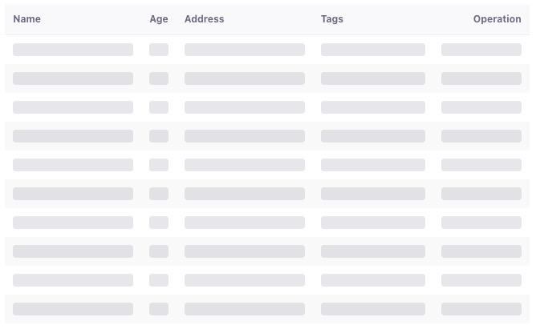

# Table Skeleton Component

A responsive content placeholder for data tables

### Overview

The Table Skeleton is a Vue 3 component designed to display elegant loading placeholders for tabular data. Built with modern web standards, it provides a smooth user experience while waiting for actual data to load.

### Key Features

-   Pure Vue 3 Composition API implementation
-   Customizable `row/column` configuration

### Use Cases

-   Data dashboard loading states
-   Admin panel placeholders
-   Content-heavy applications
-   Any interface displaying tabular data

### Preview

